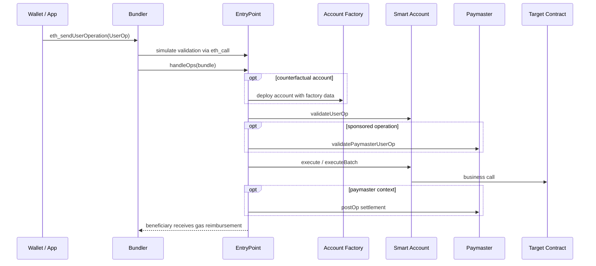

# Ethereum 技术体系

> 核验日期：2026-07-16
>
> 状态标签：`[已上线]` 已进入主网协议；`[工程化中]` 有生产实现但架构或部署仍持续演进；`[提案]` 尚未成为主网既定事实；`[研究中]` 仍处于研究、原型或愿景阶段。

## 主题简介：What / Why / How

- **What**：Ethereum 是一个由分布式共识保护、可执行智能合约的通用状态机。节点对同一批交易进行确定性执行，并以状态根承诺执行结果。
- **Why**：它让互不信任的参与者可以共享状态、资产和程序规则，不依赖单一运营方，同时允许任何人验证历史和当前状态。
- **How**：共识层决定规范链和最终性，执行层运行 EVM 并更新状态，数据可用性保证验证者能取得重放所需的数据，密码学把身份、承诺和证明连接起来。

可以用一条主线理解全文：**用户签名交易 → P2P 传播 → proposer 构块 → EVM 执行 → attestations 选择链头 → checkpoint 最终确认**。

## 1. 整体架构

### 1.1 三个逻辑层次

| 层次 | 解决的问题 | 关键对象 |
| --- | --- | --- |
| 执行层（EL） | 交易是否合法、执行结果是什么 | EVM、账户状态、交易、Receipt、state root |
| 共识层（CL） | 哪个区块是链头、何时不可逆 | validator、slot、epoch、attestation、checkpoint |
| 数据可用性（DA） | 重放和验证所需数据是否可取得 | calldata、blob、sampling（研究方向） |

客户端通过 Engine API 配合：共识客户端选择 payload，执行客户端验证交易并计算状态。这里的“分层”不是三条独立链；它们共同定义一个 Ethereum 区块。

### 1.2 一笔交易的生命周期

1. 钱包读取 `chainId`、nonce 和费用参数，构造并用 secp256k1 私钥签名。
2. RPC 节点检查编码、签名、nonce、余额和费用下限，将其放入 txpool 并传播。
3. proposer/builder 选择交易并形成 execution payload；执行客户端按顺序运行交易。
4. 每笔交易要么成功提交状态，要么回滚其状态改动；两者都会消耗已使用的 gas 并产生 Receipt。
5. 验证者验证区块并发出 attestation；fork choice 决定 head，Casper FFG 为 checkpoint 提供 finality。

`pending`、`safe`、`finalized` 是不同置信度。面向充值入账、跨链释放等不可逆副作用，不能把“RPC 查到了交易”当成最终确认。

### 1.3 核心数据对象

- **账户**：EOA 由私钥控制；合约账户由 code 控制。账户状态包含 `nonce`、`balance`、`storageRoot`、`codeHash`。
- **交易**：用户签名的状态转换请求。typed transaction 通过类型字节扩展费用、access list、blob 等语义。
- **区块**：共识信息与 execution payload 的组合；区块头承诺交易、Receipt 和状态结果。
- **Receipt**：执行结果元数据，包括状态、累计 gas、logs bloom 和 logs；它不是合约返回值。
- **根**：`stateRoot` 承诺全局账户状态；`transactionsRoot` 和 `receiptsRoot` 分别承诺交易列表和 Receipt 列表。

## 2. 共识与 Staking

### 2.1 Slot、Epoch 与委员会 `[已上线]`

Ethereum PoS 以 12 秒 slot 推进，32 个 slot 构成一个 epoch。每个 slot 选出一个区块 proposer，并将验证者分配到委员会进行 attestation。slot 没有区块并不等于链停止，后续 slot 仍可继续。

验证者通过存入质押、激活队列进入集合。退出也受 churn limit 约束；可提款不等于立即退出共识职责。奖励来自正确、及时地提议或证明，惩罚针对离线和错误投票；双重提议、环绕投票等可被 slashing。

### 2.2 LMD-GHOST 与 Casper FFG

- **LMD-GHOST fork choice**：使用每个验证者最新消息的权重，在尚未最终确认的分叉中选择链头。
- **Casper FFG finality gadget**：验证者对 epoch checkpoint 投票；达到阈值后 checkpoint 先 justified，再 finalized。

两者回答不同问题：fork choice 追求“现在跟随哪条链”，finality 回答“哪些历史不应再被回滚”。只有链头而没有最终性，不能提供同等级别的结算保证。

### 2.3 安全性、活性与弱主观性

- 大规模验证者离线会损害活性；inactivity leak 通过逐步降低离线权重帮助在线方恢复 finality。
- 冲突 checkpoint 若都最终化意味着至少有大量权益违反规则，并可提供可验证的 slashing evidence。
- **弱主观性**：长期离线节点不能只凭任意旧 genesis 和“最长/最重链”安全同步，需要一个近期可信 checkpoint。
- 短重组可能发生在 head 附近；最终化重组属于极端安全事件，而不是普通索引器可以静默覆盖的情况。

### 2.4 高频问答

**问：PoS 的 fork choice 和 finality 为什么要分开？**

答题骨架：先说网络延迟下链头需要快速选择，再说经济最终性需要更强阈值；LMD-GHOST 提供实时 head，FFG 对 checkpoint 投票，前者偏活性，后者提供可惩罚的安全承诺。

**问：Staking 收益来自哪里？**

答题骨架：协议发行的共识奖励、区块提议相关收益和执行层 priority fee/MEV；同时承担离线惩罚、slashing 和资金机会成本。不要把收益描述成固定利率。

## 3. 交易执行与 EVM

### 3.1 执行模型

EVM 是基于栈的确定性虚拟机。一次顶层交易创建调用帧；内部调用继续创建帧，每个帧拥有独立的 stack、memory、calldata 视图和剩余 gas。合约之间顺序执行，共享同一顶层交易的原子性。

异常（out of gas、invalid opcode、未捕获的 revert）会回滚对应调用帧的状态。调用方可以检查低级调用返回值并选择处理失败，因此“内部调用失败”不必然让顶层交易失败。

### 3.2 调用与创建

| 指令/语义 | 执行代码 | 读写 storage | `msg.sender` / `msg.value` | 典型用途 |
| --- | --- | --- | --- | --- |
| `CALL` | 目标地址 | 目标合约 | 当前合约 / 指定 value | 普通跨合约调用 |
| `DELEGATECALL` | 目标地址 | 调用方合约 | 保留上层上下文 | Proxy、Library |
| `STATICCALL` | 目标地址 | 禁止状态写入 | 当前合约 / 0 | 只读调用 |
| `CREATE` | init code | 新合约 | 创建者 | 基于 nonce 的部署地址 |
| `CREATE2` | init code | 新合约 | 创建者 | 基于 salt 与 init-code hash 的确定地址 |

`delegatecall` 最大的风险不是“调用了外部代码”这句空话，而是**被调用代码按调用方的 storage layout 写槽位**。升级合约的布局兼容性在 [05-programming-languages.md](05-programming-languages.md#3-solidity) 详述。

### 3.3 Storage、Memory、Calldata

- `storage` 持久存在于账户状态中，读写昂贵，槽位为 32 bytes。
- `memory` 只在调用帧生命周期内存在，线性扩张且扩张成本非线性增加。
- `calldata` 是只读输入；外部函数可直接引用，避免不必要复制。
- stack 最快但深度和寻址受限；编译器负责在这些位置间搬运值。

### 3.4 Gas 与 EIP-1559 `[已上线]`

Gas 同时限制计算资源、为区块容量定价并阻止无限循环。EIP-1559 交易指定 `maxFeePerGas` 和 `maxPriorityFeePerGas`：base fee 随父区块拥塞调整并被销毁，priority fee 给区块构建者/提议者。实际单价受两者和当前 base fee 共同约束。

交易替换通常要求同一 sender、同一 nonce，并提高费用。相同 nonce 最终最多有一个交易进入规范链；“dropped”可能是节点清池，“replaced”是另一个交易占用了 nonce，两者都要靠链上 canonical 状态判定。

MEV 来自排序、插入和排除交易的价值。协议分析要区分 proposer、builder、relay 等角色；PBS 试图分离提议权和构块市场，但链下 PBS 与协议内 ePBS 不是同一个上线状态。

### 3.5 Event、Receipt、`eth_call` 与 Trace

- Event 被编码为 log，属于 Receipt；它适合索引，不可被同一交易后的合约代码读取。
- `eth_call` 在指定区块状态上模拟执行，不上链、不产生持久状态，也不保证未来实际交易一定成功。
- Trace 是客户端重放得到的调试视图，不是共识层对象；不同客户端/Tracer 输出格式可能不同。
- `status=1` 只说明顶层交易没有回滚，不证明业务语义成功；还需校验事件、状态与目标合约。

### 3.6 Account Abstraction（AA）与 Gas Abstraction

#### 3.6.1 What / Why / 两条路径

传统 EOA 的验证逻辑固定为一把私钥签名，且发起交易的地址必须持有 ETH 支付 gas。这使多签、恢复、session key、批量执行和新用户免 ETH onboarding 都需要钱包外部拼装多个交易或依赖中心化 relayer。

**Account Abstraction（AA）**把“谁能授权执行、如何付费、怎样执行一组调用”的一部分逻辑交给可编程账户。它不表示所有账户已经变成合约；需要先区分两条路径：

| 路径 | 核心机制 | 账户形态 | 适合的问题 | 状态与边界 |
| --- | --- | --- | --- | --- |
| ERC-4337 | `UserOperation` 进入独立 mempool，由 Bundler 调用 EntryPoint `handleOps` | 独立 Smart Contract Account | 自定义验证、原子批量调用、Paymaster、无需用户 EOA 支付 gas | `[已上线]` 高层协议与基础设施；不改变 Ethereum 共识交易类型 |
| EIP-7702 | EOA 签署 authorization，将代码委托给 audited implementation | 保留地址/余额/nonce 的 delegated EOA | 为既有 EOA 获得批量调用、权限与 gas abstraction 能力 | `[已上线：Ethereum Pectra]`；每条目标链仍需核验是否激活及钱包支持 |

ERC-4337 的 Smart Account 可以不以用户 EOA 作为日常 gas 付款方；EIP-7702 的授权仍由 EOA 私钥签署。二者可组合，但不是替代关系：4337 解决一套上层交易与捆绑框架，7702 是协议层允许 EOA 临时代码委托的能力。

#### 3.6.2 ERC-4337 生命周期 `[已上线]`

`UserOperation` 是上层伪交易，不是共识对象。它至少描述 `sender`、nonce、factory/init data、`callData`、执行与验证 gas 上限、EIP-1559 费用参数、可选 Paymaster 数据和 signature。Bundler 先模拟验证，再将多个 UserOp 打包成一笔普通 EOA transaction 调用 EntryPoint；链上真正的 transaction hash、Receipt 和 gas 付款者属于这个 bundle。

EntryPoint 的关键顺序是先验证、后执行：必要时由 factory 部署 counterfactual account，然后调用 account 的 `validateUserOp`；若使用 Paymaster，再检查其 deposit 并调用 `validatePaymasterUserOp`。验证通过后才执行 account 的 `callData`。这样 Bundler 可以过滤明显无效或无法支付费用的操作，但 simulation 成功不是最终入块保证。

Factory 通常使用 `CREATE2`，让用户在账户实际部署前就拥有稳定地址并可先收款。地址的确定性依赖 factory、salt 和 init code hash；升级 factory 或改变初始化编码会得到另一地址，不能只把“同一个 owner”当作地址身份。

#### 3.6.3 Smart Account 设计

Smart Account 的设计目标是把安全边界拆成可审计职责，而不是把所有功能塞进一个 `execute`：

| 职责 | 推荐设计 | 主要权衡与审计点 |
| --- | --- | --- |
| `validateUserOp` | 仅允许可信 EntryPoint 调用；校验 `userOpHash`、签名、nonce、时间窗与权限 | 错误的 hash 域、可重放签名或任意 caller 可直接接管账户 |
| `execute/executeBatch` | 由 EntryPoint 或账户自身受控入口调用；目标、value、calldata 都进入授权范围 | 批量调用提高 UX，也扩大一次签名的爆炸半径 |
| keyed nonce | 用不同 nonce key 隔离普通操作、管理员操作和 session key 操作 | 可并行流水线，但每个 key 都要单调、可撤销且有独立权限 |
| factory / 初始化 | `CREATE2` 部署；初始化只允许一次且限制可信创建路径 | 防止 implementation/未初始化账户被抢占或重复初始化 |
| 模块化权限 | 将 signer、session key、recovery、limit、hook 分成最小模块与显式 selector 权限 | 模块安装/卸载本身是最高权限操作，需要 timelock 或多签策略 |
| 升级 | 优先稳定 storage namespace、版本化 initializer、受限 upgrade path | proxy/`delegatecall` 的 storage collision 与实现接管风险 |

常用能力包括：

- **Multisig**：多把 signer key 按阈值授权；适合高价值账户，但签名聚合、成员变更和紧急阈值要单独设计。
- **Session key**：将临时 key 限制到特定 dApp、chain、selector、额度和过期时间；撤销必须即时生效，不能只依赖客户端隐藏按钮。
- **Social recovery**：guardian 可在延迟窗口内恢复 owner；guardian 变更、恢复取消和恢复期间权限要有清晰状态机。
- **Spending limit**：按 token、目标、周期和价值计量额度；token decimals、transfer fee、批量调用和 `delegatecall` 都可能绕过粗糙的限额逻辑。

Smart Account 常可升级，但“账户可恢复”不意味着“管理员可随意升级”。应分别列出 owner、module manager、guardian、upgrade admin 和 emergency pause 的权限图。Solidity 的 proxy、storage layout 与模块审计细节见 [05-programming-languages.md](05-programming-languages.md#39-smart-account-与-aa-实现审计)。

#### 3.6.4 Gasless / Paymaster 设计

Gas abstraction 改变的是**谁在链上预存 ETH、谁最终承担 gas 成本、用户如何被结算**。用户没有 ETH 可以做到 gasless UX，但 gas 仍由 Bundler 的 bundle transaction 消耗，最终要由 account deposit、Paymaster deposit 或某个业务方承担。

| 模式 | 费用承担者 | 验证与结算 | 适合场景 | 主要风险 |
| --- | --- | --- | --- | --- |
| dApp 全额赞助 | dApp/Paymaster | 后端签发短期 sponsor authorization；Paymaster 在验证期检查用户、链、selector、额度、有效期 | 首次使用、活动、白名单业务 | 盗刷、女巫、预算耗尽、Bundler/Paymaster griefing |
| ERC-20 代扣 | 用户持有的指定 token，Paymaster 先垫 ETH | 预扣最大 token 成本，`postOp` 依实际 gas 结算并退款 | 用户无 ETH 但持有稳定币/应用 token | 报价过期、价格操纵、流动性不足、`postOp` 失败与代扣上限 |

**dApp 赞助策略**应至少约束 `chainId`、EntryPoint、account、目标合约/selector、`callData` 或其 hash、单笔/日额度、有效期和 sponsor nonce。后端只对经过风控的 UserOp 签名；Paymaster 在链上验证该授权，不能只相信前端传来的“用户已通过验证”。额度可以按用户、设备、活动、资产价值或风险等级分层，并应保留紧急 pause 与预算熔断。

**ERC-20 代扣**不是“免费交易”。Paymaster 应把可接受 token、报价来源、最大滑点、预扣上限和退款路径写入策略。报价、预扣和最终 gas 成本天然不在同一个时间点；设计应接受有限价格偏差，并为 token 转账失败、fee-on-transfer/rebasing token 和 `postOp` 异常建立拒绝或人工补偿策略，而不是假设每个 ERC-20 行为一致。

Paymaster 需要在 EntryPoint 保有足够 deposit 来垫付 bundle gas，并面对 stake/reputation 等 anti-DoS 要求。业务预算是链下财务约束，EntryPoint deposit 是链上可用性约束；两者都必须监控，任一耗尽都会使“gasless”请求失败。

#### 3.6.5 Bundler 与服务端可靠性

Wallet/App 的稳定 operation ID 应与 UserOp hash、最终 bundle transaction hash 分离：同一业务操作可能因费用调整、有效期重签或 Bundler 拒绝产生多个 UserOp，最终又被某个 bundle 纳入 canonical 链。

建议将服务状态建模为：

`DRAFT → SIGNED → SUBMITTED → ACCEPTED → INCLUDED → FINALIZED`

其中 `ACCEPTED` 仅表示某个 Bundler 的模拟/接收结果，不能视为链上承诺。旁路状态包括：

- `REJECTED`：签名、nonce、gas、Paymaster policy 或 Bundler simulation 不通过；先分类再修正，不能盲重试。
- `DROPPED`：mempool/服务端不再可见；仍可能晚到入块，须查询 UserOp hash 和 nonce。
- `REPLACED`：同一 nonce key 出现更高费用或更新授权的操作；业务层只能允许一个 canonical 结果。
- `REORGED`：已观察到的 bundle 不再规范；回退到待确认并重新验证 account nonce、Paymaster 结算和业务副作用。

Bundler 服务应在提交前模拟 account 与 Paymaster validation，限制 per-account/per-IP/per-policy 并发和 gas 暴露，记录 sponsor decision、UserOp hash、Paymaster reservation、bundle hash、实际费用与最终状态。对账至少比较：链下已预留预算、EntryPoint deposit 变化、Paymaster token 结算、`eth_getUserOperationReceipt`/链上事件和业务执行结果。

#### 3.6.6 安全与故障场景

| 场景 | 后果 | 设计回应 |
| --- | --- | --- |
| 签名域或 nonce 不完整 | 跨链、跨 EntryPoint 或跨动作重放 | 将 chain ID、EntryPoint、account、action、nonce key、deadline 和关键 calldata 绑定到 hash |
| nonce 并发管理错误 | 合法请求互相阻塞或替换错误 | 按 account + nonce key 串行分配；替换前查询链上/EntryPoint 状态 |
| 模块、recovery 或 upgrade 权限过大 | 攻击者绕过 owner 签名 | 最小 selector 权限、延迟、guardian 审计、可撤销 session key 与独立权限图 |
| counterfactual 初始化可重复/可抢占 | owner 或实现被初始化攻击 | factory/EntryPoint 限制、一次性 initializer、初始化参数进入签名/审计范围 |
| Paymaster 预算耗尽或 `postOp` 出错 | 用户交易失败、赞助资金被 grief | 链上 deposit 下限、链下 reservation、限额、失败策略与 token 异常白名单 |
| Bundler 拒绝或审查 | 操作长时间不被打包 | 多 Bundler、公开 mempool/自建提交路径、可观测的 rejection reason；它改善活性而非替代账户安全 |
| 模拟与真实执行状态变化 | 入块时 validation/业务调用失败 | 缩短有效期、重取 nonce/fee、有限重试；把 simulation 结果标为预测而非成功 |
| EIP-7702 恶意授权 | EOA 将完整控制权委托给恶意代码 | 钱包只展示已审计 implementation；授权内容、chain 和有效期清晰可见，不让 dApp 自行诱导签署 |
| transient storage 泄漏 | 同一 bundle 中不同 UserOp 互相影响 | 不把 transient storage 作为跨 UserOp 的敏感授权状态；显式清理并按 account 隔离 |

## 4. 状态与存储

### 4.1 Merkle Patricia Trie

Ethereum 传统状态承诺使用十六进制 Merkle Patricia Trie（MPT）。key 被视为 nibble 序列；branch 节点有 16 个子项和一个 value，extension 压缩公共路径，leaf 保存剩余路径和值。Hex-Prefix 编码区分 leaf/extension 和奇偶路径，节点再经 RLP 编码；较小节点可内嵌，较大节点以 Keccak hash 引用。

Account Trie 以地址哈希为 key，value 是账户 RLP；每个合约账户的 `storageRoot` 再指向独立 Storage Trie。交易树和 Receipt 树承诺的是按索引编码的列表，不应和状态树混为一谈。

### 4.2 Proof 与不存在性证明

Merkle proof 给出从根到目标路径所需节点。验证者逐级解码、核验 hash 和路径：抵达匹配 leaf 得到存在性；遇到缺失 branch 子项或路径不匹配，得到不存在性。证明可信度最终锚定在可信区块头的 root。

常见错误是“只验 proof，不验 block header 来源”。跨链或离线证明必须同时回答：这个 root 属于哪条规范链、确认级别是什么、验证者如何获得可信 header。

### 4.3 工程问题与节点类型

MPT 的内容寻址和随机路径带来随机 I/O、写放大和缓存压力；历史状态持续积累又造成磁盘增长。客户端通常引入 snapshot、flat state、缓存、prefetch、pruning 和分层数据库，但这些是**持久化实现优化**，不能擅自改变共识承诺。

- Full node 验证当前链，通常不保留任意高度的全部历史状态。
- Archive node 保留历史状态查询能力，成本显著更高。
- Pruned node 删除不再需要的数据；是否能查历史 transaction/receipt/state 要分项确认。

Geth 与 Reth 的数据库表、静态文件和 pipeline 设计不同，但都必须计算出相同的共识结果。节点、同步和索引器设计详见 [04-general-infrastructure.md](04-general-infrastructure.md#7-节点rpc-与索引器)。

### 4.4 状态演进 `[研究中]`

- **Stateless validation / witness**：区块携带或可获得执行所需证明，让验证者不必保存完整状态。
- **Verkle tree**：希望缩小 witness；它不是截至核验日已替换主网 MPT 的事实。
- **State expiry**：让久未访问状态需要 witness 才能复活，仍属研究方向。
- 应把“共识树结构变化”“客户端 flat database”“历史数据过期”分开讨论。

## 5. 密码学

### 5.1 ECDSA、地址与消息签名

EOA 使用 secp256k1 ECDSA。Ethereum 地址取未压缩公钥主体的 Keccak-256 后 20 bytes。交易签名结合 chain ID 防止跨链重放；`ecrecover` 可从消息摘要和签名恢复公钥对应地址。

EIP-191 为签名数据增加域前缀，EIP-712 对结构化数据编码并用 domain separator 绑定 chain、合约和应用域。正确实现还需要 nonce/deadline；“使用 EIP-712”本身不自动消除重放。

### 5.2 BLS 聚合签名 `[已上线：共识层]`

BLS 允许多个签名聚合，适合大量验证者 attestations。聚合减少网络和验证开销，但必须处理公钥注册、Proof of Possession 或等价防护，以避免 rogue-key 攻击。BLS 与 EOA 的 ECDSA 用途不同，不能因共识层使用 BLS 就说 Ethereum 账户改成 BLS。

### 5.3 Blob 与 KZG `[已上线]`

EIP-4844 引入 blob-carrying transaction。blob 数据不由 EVM 直接逐字读取，EVM 看到的是版本化 hash；KZG commitment 允许对多项式承诺进行简洁的点值证明。KZG 依赖 trusted setup，而 blob 提供的是面向 rollup 的临时 DA，不是永久合约存储。

### 5.4 SNARK、STARK 与 zkEVM

| 技术 | 主要优势 | 主要代价 |
| --- | --- | --- |
| SNARK | 证明小、链上验证便宜 | 常见方案需 setup；电路与 prover 复杂 |
| STARK | 透明、抗量子假设更友好 | 证明通常更大 |
| zkEVM | 证明 EVM/EVM-like 执行 | 兼容性、证明效率、工程复杂度互相权衡 |

零知识证明解决“计算正确性/隐私”的某些部分，不自动解决 DA、sequencer 活性、桥升级权限或合约漏洞。

## 6. Layer 2

### 6.1 Rollup 通用结构

Rollup 将执行和排序移到 L2，把交易数据或数据承诺提交到 L1，并用欺诈证明或有效性证明约束状态转换。分析一个 rollup 时依次问：谁排序、数据在哪里、谁能强制包含、状态如何证明、跨层消息何时最终、升级密钥归谁。

### 6.2 Optimism 与 Arbitrum

| 维度 | OP Stack / Optimism | Arbitrum Nitro |
| --- | --- | --- |
| 证明类别 | Optimistic fault proof | Optimistic interactive fraud proof |
| 执行视角 | EVM 等价导向，OP Stack 组件化 | Nitro/WAVM 证明路径，EVM 兼容 |
| 挑战 | 对声明提出 fault proof | 争议逐步缩小到单步证明 |
| 提款 | 需等待争议窗口（canonical path） | 同样受挑战/确认流程约束 |
| 费用 | L2 执行 + L1/DA 成本 | L2 执行 + L1/DA 成本，压缩模型不同 |

表格描述的是设计重点，实际部署版本和参数会演进。面试中不要背固定天数或费用常数，应说明从链配置和官方文档核验。

### 6.3 ZK Rollup 对照

ZK Rollup 提交 validity proof，L1 验证证明后接受状态转换，不依赖“有人在窗口内挑战错误状态”。代价是 prover、递归聚合、电路升级和 EVM 兼容的工程复杂度。有效性证明仍不等于数据可用性；validium 等把数据放链下，会引入额外退出风险。

### 6.4 主要故障场景

- Sequencer 宕机或审查：是否存在 L1 强制包含/逃生路径？
- L1 重组：L2 safe/finalized head 如何回退？
- 数据不可用：用户能否独立构造退出证明？
- Bridge/upgrade key 被攻破：证明系统正确也无法抵消管理员权限风险。
- 提款等待：流动性桥可提前垫付，但把风险转移给 LP，不改变 canonical finality。

## 7. Lean Ethereum `[研究愿景]`

Lean Ethereum 是 2025 年提出的研究愿景，不是单一 EIP，也不是已经承诺的主网路线图。可按三个方向理解：

- **Lean Consensus**：更精简、可形式化验证的共识，探索抗量子签名和快速最终性。
- **Lean Data**：围绕 blob、DAS 和更高数据吞吐扩展。
- **Lean Execution**：ZK-friendly execution、实时证明与更易验证的执行栈。

“Fort Mode / Beast Mode”是愿景性性能与安全目标的表达，不应作为当前主网参数。回答时要明确证据层次：博客愿景 → 研究原型/开发网 → 具体 EIP → 客户端实现 → fork 激活，只有最后一步才可标为主网上线。

## 8. 建议补充的演进主题

### 8.1 PBS、Builder 与 Proposer

当前 MEV-Boost 等链下市场与协议内 proposer-builder separation（ePBS）要分开。builder 优化交易排序并构造 payload，proposer 选择并签署区块；分离可以促进构块竞争，也带来 relay 依赖、审查和 builder 集中化问题。EIP-7732 截至核验日应标为 `[提案]`，不能写成当前共识流程。

### 8.2 DAS 与实时证明

Data Availability Sampling 试图让节点抽样而非下载全部扩展数据；实时证明要求 prover 在严格时限内完成证明。两者分别受网络采样安全和 prover 性能约束，不能仅用 TPS 评价。

## 9. 高频面试问题与答题骨架

1. **交易为什么会成功但业务失败？** 先区分顶层 EVM status 与业务条件，再检查事件、内部调用返回值、代理目标和状态差异。
2. **MPT 为什么既能证明存在又能证明不存在？** 根承诺 + 路径节点；不匹配 leaf 或空分支构成可验证的路径终止。
3. **`call` 与 `delegatecall` 的本质区别？** 代码地址与状态上下文是否相同，随后落到 proxy 布局和权限风险。
4. **L2 安全性是否等于 Ethereum？** 分拆为状态正确性、DA、排序活性、桥和升级权限；逐项判断继承程度。
5. **KZG 和 ZK proof 是一回事吗？** KZG 是多项式承诺工具；ZK proof 是更完整的计算声明证明体系，KZG 可作为某些证明系统组件。
6. **节点追块慢怎么定位？** 拆为下载、验证、执行、状态读写、snapshot/compaction 和 peer 质量，转到基础设施文档作系统诊断。
7. **ERC-4337 是否改变 Ethereum 共识？** 不改变。UserOp 是上层对象，Bundler 最终发送普通 transaction 调用 EntryPoint；因此要区分 UserOp 接收、bundle 入块和链上 finality。
8. **Paymaster 如何防盗刷？** 策略同时绑定 account、chain、EntryPoint、目标调用、额度、有效期与 sponsor nonce；链下风控签发、链上验证、预算 reservation、deposit 监控和熔断缺一不可。
9. **EIP-7702 与 Smart Account 的关系？** 7702 让 EOA 委托代码，4337 提供 Smart Account/UserOp/Bundler 框架；可组合，但 7702 authorization 仍由 EOA key 签署。
10. **如何判断 UserOp 成功？** 依次区分 Bundler accepted、bundle included、目标调用是否成功、Paymaster 是否正确结算和 bundle 是否 finalized；不能只看 `eth_sendUserOperation` 的返回值。

## 10. 容易混淆或说错的点

- `Receipt` 不包含 Solidity 返回值；Event 也不是状态本身。
- `eth_call` 成功不保证交易入块时成功，因为状态和 block context 会变化。
- EIP-1559 没有消除 gas price 波动，也没有把所有费用都销毁。
- Finalized、safe、latest/pending 不是同义词。
- 客户端 flat state/snapshot 不代表共识状态根不再使用 MPT。
- Blob 不是合约可长期读取的廉价 storage。
- Optimistic Rollup 不是“中心化数据库 + 七天后自动可信”；安全性依赖 DA、挑战者、证明和桥配置。
- Lean Ethereum、Verkle、state expiry、ePBS 必须标注状态，不能与主网事实混写。
- UserOp 不是 Ethereum transaction；其 hash、bundle transaction hash 和业务 operation ID 不是同一个身份。
- Paymaster 代付 ETH 不等于用户免费；ERC-20 代扣只把支付媒介和结算时点改变。
- ERC-4337 不要求所有 EOA 升级为合约；EIP-7702 也不自动提供安全的模块、恢复或额度策略。
- Bundler simulation 成功不等于必然入块，更不等于目标业务调用成功或已 final。

## 11. 官方资料与延伸阅读

- [Ethereum Proof-of-Stake](https://ethereum.org/developers/docs/consensus-mechanisms/pos/)
- [Block proposal 与 slot/epoch](https://ethereum.org/developers/docs/consensus-mechanisms/pos/block-proposal/)
- [Attestations](https://ethereum.org/developers/docs/consensus-mechanisms/pos/attestations/)
- [Execution specification](https://github.com/ethereum/execution-specs)
- [Consensus specification](https://github.com/ethereum/consensus-specs)
- [EIP-1559](https://eips.ethereum.org/EIPS/eip-1559) 与 [EIP-4844](https://eips.ethereum.org/EIPS/eip-4844)
- [Merkle Patricia Trie](https://ethereum.org/developers/docs/data-structures-and-encoding/patricia-merkle-trie/)
- [Geth database](https://geth.ethereum.org/docs/fundamentals/databases) 与 [Reth storage](https://reth.rs/run/storage/)
- [Optimism fault proof explainer](https://docs.optimism.io/op-stack/fault-proofs/explainer)
- [Arbitrum Nitro whitepaper](https://docs.arbitrum.io/nitro-whitepaper.pdf)
- [Statelessness roadmap](https://ethereum.org/roadmap/statelessness/) 与 [Verkle trees](https://ethereum.org/roadmap/verkle-trees/)
- [Lean Ethereum](https://blog.ethereum.org/2025/07/31/lean-ethereum)
- [EIP-7732: ePBS](https://eips.ethereum.org/EIPS/eip-7732)
- [ERC-4337: Account Abstraction Using Alt Mempool](https://eips.ethereum.org/EIPS/eip-4337)
- [EIP-7702: Set Code for EOAs](https://eips.ethereum.org/EIPS/eip-7702)
- [Ethereum Account Abstraction Roadmap](https://ethereum.org/roadmap/account-abstraction/)
- [Official ERC-4337 Documentation](https://ethereum.org/developers/tools/erc-4337-documentation/)
